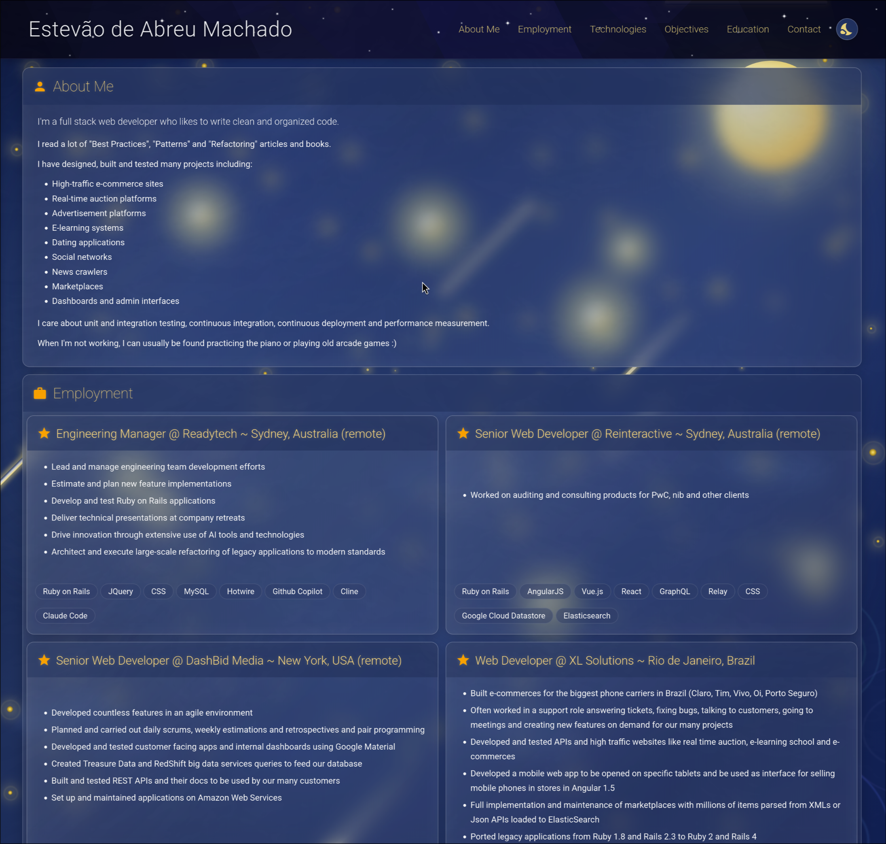

<p align="center">
  <a href="https://www.estevaom.com"></a>
  <a href="https://www.rust-lang.org/"></a>
  <a href="https://bun.sh/"></a>
  <a href="https://vuejs.org/"></a>
  <a href="https://getmdl.io/"></a>
</p>

<p align="center">
  
</p>

Personal portfolio website showcasing professional experience, technical skills, and projects.

## Architecture

The site uses a modern static generation approach with a Rust build tool that transforms JSON data into GraphQL-like API responses, which are then consumed by a Vue 3 frontend.

### Technology Stack

- **Build Tool**: Rust with serde/serde_json for data processing
- **Runtime**: Bun for package management and development server
- **Frontend Framework**: Vue 3 with Composition API
- **Build System**: Vite
- **UI Library**: Material Design Lite (MDL)
- **Hosting**: GitHub Pages with GitHub Actions for CI/CD

## Project Structure

```
/
├── app/                    # Vue 3 application
│   ├── src/               # Vue components and application logic
│   ├── public/            # Static assets (themes, styles, images)
│   └── package.json       # Vue application dependencies
├── build/                 # Rust build tool
│   ├── src/               # Rust source code
│   └── Cargo.toml        # Rust dependencies
├── data/                  # Source data files
│   ├── employment.json    # Work experience data
│   ├── technologies.json  # Technology definitions
│   └── resume.json       # Resume structure and categories
└── dist/                  # Build output (gitignored)
    └── api/              # Generated API responses
```

## Development

### Prerequisites

- Rust (latest stable)
- Bun (latest version)

### Getting Started

1. Clone the repository
2. Run the development server:
   ```bash
   ./dev.sh
   ```

This script will:
- Build the API responses using the Rust tool (if not already built)
- Start the Vue development server on http://localhost:5173

### Building for Production

```bash
./build.sh
```

This generates a production-ready build in the `app/dist` directory.

## Deployment

The site is automatically deployed to GitHub Pages when changes are pushed to the main branch. The GitHub Actions workflow handles:

1. Building the Rust API generator
2. Installing dependencies
3. Building the Vue application
4. Deploying to GitHub Pages

## Data Management

Content is managed through JSON files in the `/data` directory:

- **employment.json**: Professional experience entries
- **technologies.json**: Technology definitions with URLs
- **resume.json**: Categorizes technologies and defines the resume structure

After modifying data files, run the build process to regenerate the API responses.

## Features

- Responsive design with Material Design components
- Three theme options: Light, Dark, and Starry Night
- Static site generation for optimal performance
- GraphQL-like API structure for future scalability
- Smooth scrolling navigation
- Mobile-optimized layout

---

Built with Claude Opus 4 @ Claude Code
