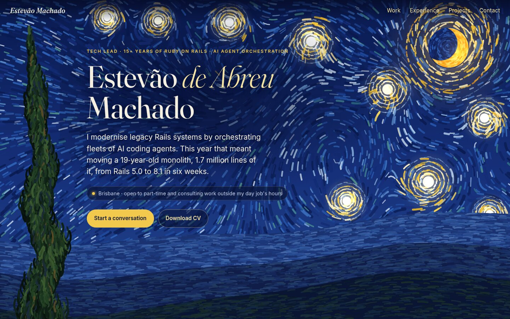

# estevaom.github.io

[](https://www.estevaom.com)

<p align="center">
  
</p>

My personal site and CV. The Starry Night theme is a live painting: the sky is laid down once
with a few thousand flow-field brushstrokes, a few hundred more keep drifting along the same
currents, and the hills and cypress sink away as you scroll up into the sky.

## Stack

- **[Astro](https://astro.build)**: the page is rendered to static HTML at build time, so the content
  is readable without JavaScript, by search engines and by link previews.
- **Canvas 2D** for the painting, in plain JavaScript (`src/scripts/starry-night.js`), no dependencies.
- **Bun** for installing, building and scripts.
- **Playwright** renders the CV PDF and the link-preview image from the built page.
- **GitHub Pages**, deployed by GitHub Actions on every push to `master`.

## Layout

```
data/                 Content, the single source of truth
  profile.json        Name, headline, availability, contact, education
  work.json           Headline stats and case studies
  employment.json     Timeline
  skills.json         Tools, grouped
  projects.json       Open-source repos (star counts are fetched at build time)
src/
  pages/index.astro   The page, assembled from the components below
  components/         One component per section, plus StarryNight (the canvases)
  scripts/            The painting engine
  styles/global.css   Layout, the Starry Night tokens, and the print stylesheet (the CV)
  themes.ts           The list of themes; the toggle appears once there is more than one
scripts/snapshots.mjs Writes dist/cv.pdf and dist/og.jpg from the built site
```

## Development

```bash
bun install
bun run dev          # http://localhost:4321, add ?hud to see the painting's frame rate
bun run check        # type-check
bun run build        # static site in dist/
bun run snapshots    # dist/cv.pdf and dist/og.jpg (needs a build first)
```

`snapshots` uses Playwright's Chromium (`bunx playwright install chromium`), or a system one via
`CHROMIUM_PATH=/usr/bin/chromium bun run snapshots`.

## Editing content

Change the JSON in `data/`, then check it with `bun run dev`. Everything on the page, including the
printed CV, comes from those files.
